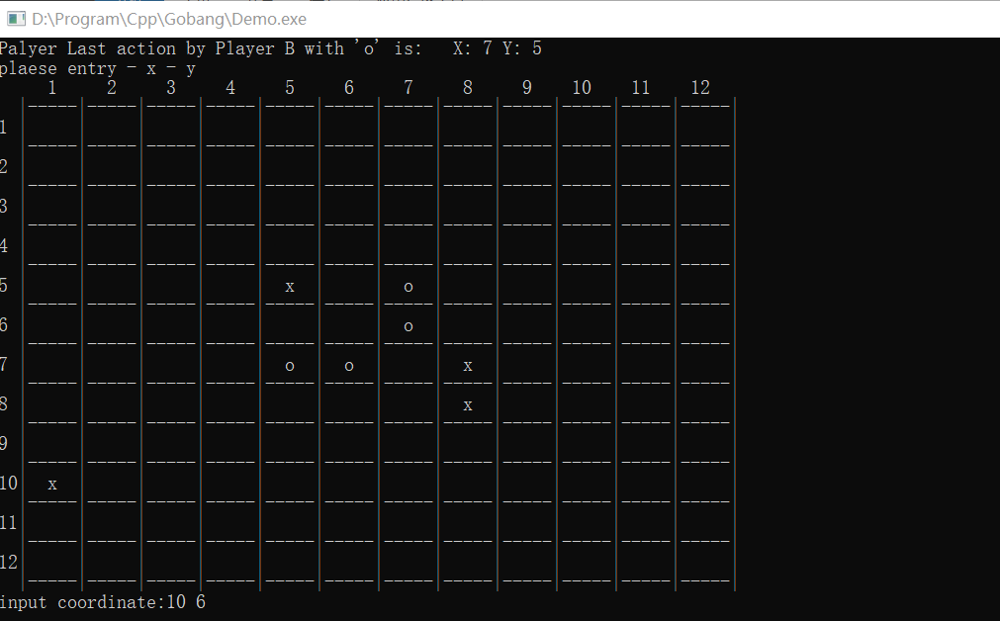
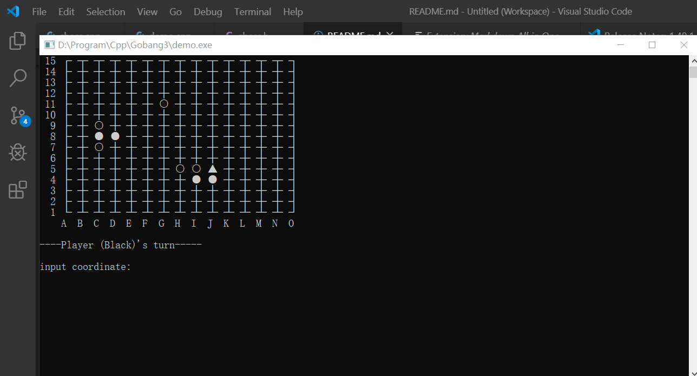

# Gobang
This repo is my 2019 Homework of UCAS C++ programming class

## 版本
- v0.1 实现人人对战及游戏逻辑
- v0.2 实现基于评分的机器人(相当愚蠢)
  
## Environment
    VSCode - version 1.40.1
    g++ - version 6.3.0 (MinGW.org GCC-6.3.0-1)

## 文件夹
- [demo.cpp](./demo.cpp)  **演示游戏 - 命令行界面 游戏运行主函数**
- demo.exe
- demo.out  
- [README.md](./README.md)
- chess.cpp chess.h **五子棋游戏类及头文件**
- chess.o demo.o **.o files**

## 版本1运行截图


## 版本2运行截图


## 代码
>游戏类
```cpp
class Chessboard
{
protected:
    int flag = 0;//下棋方 0为player1 1为player2
    int model = 1; //游戏模式 0为双人对战 1为人机对战
    int Board[N][N]={0};//用字符串二维数组表示纵横交界
    int scoreBoard[N][N]={0}; //电脑评分棋盘
    int score[2]={0};//player1、2的分数
    enum Message{Position_Occupy,Invalid_Input,Correct_Input} mess;
public:
    Chessboard();
    ~Chessboard();
    void run();

    void GameUI(); //游戏UI
    void initBoard(); //初始化棋盘 不显示
    void RenewBoard();//更新棋盘 并显示
    void painter(int sign);
    void Boardpainter(); //按照当前Board数组绘制棋盘 并显示
    void Put(int x,int y,int firsthand);
    int check(int x, int y);
    void ComputerMove(int &x,int &y,int firsthand,int try_num);//电脑落子
    void updatescore(int firsthand);//更新评分棋盘
    int to_coordinate(char row);
    void withdraw(int x, int y,int cur);//悔棋
    bool checkForbidden(int x,int y);//检查禁手
    int win_or_not(int x,int y,int flag,int firsthand);
    int win_or_not2(int x,int y,int flag,int firsthand);
    int CheckBoard(int i, int j, char flag);
    int Judge(int x,int y,int firsthand);
    inline void setflag(int f){flag=f;}
    inline int getflag(){return flag;};
    inline void setModel(int M){model=M;}
    inline int getModel(){return model;}
};
```

> 演示代码 demo.cpp
```cpp
#include <iostream>
#include <stdlib.h>
#include "chess.h"
using namespace std;

int main()
{   
    Chessboard a;
    a.run();
}
```

> 游戏类实现（*主体部分*） chess.cpp
```cpp
void Chessboard::run(){
    while(1){
        initBoard();
        GameUI();
        system("CLS");
        std::cout<<"************************\n";
    }
}

void Chessboard::GameUI(){
    std::cout << "_____________Start Game Gobang_________" << '\n';
    std::cout << "                                       " << '\n';
    std::cout << "_________    1.enter game : E     _____" << '\n';
    std::cout << "_________    2.chose model: M     _____" << '\n';
    std::cout << "_________    3.quit game  : Q     ____" << '\n'; 
    std::cout << "_______________________________________" << '\n';
    std::cout << "Current Model: "<<'\n';
    if(getModel()==0){std::cout<<"Human vs Human \n";}
    else std::cout<<"Human vs Computer \n";
    std::cout << "_______________________________________" << '\n';
    std::cout << "Please input instruction:";
    char command,Model='C';mess=Correct_Input;
    cin>>command;
    if(command=='E'){
        system("CLS");
        if(0==model){
            std::cout<<"your are playing with human now ,two players!"<<'\n';
            std::cout<<"please set who go first(Player1:Human Player2:Human) 1 or 2"<<'\n';
        }else if(1==model)
        {
            std::cout<<"your are playing with computer now!"<<'\n';
            std::cout<<"please set who go first(Player1:Human Player2:Computer) 1 or 2"<<'\n';
        }
        int firsthand=0;//先手 1为player1执黑 2为player2执黑
        std::cin>>firsthand;
        flag=firsthand-1;
        initBoard();
        int firststep=1;//是该局第一步
        int x_last=5,y_last=5;//维护上一步的落子位置
        mess=Correct_Input;
        int try_num =0;//电脑尝试computermove次数
        int flag2=0;

        //该while循环为双人对战模式
        while(0==getModel()){   
            system("CLS");
            Boardpainter();
            if(flag==0){ //player1's move
                if(firsthand==1){
                    std::cout<<"\n----Player 1(Black)'s turn-----\n";
                }else
                {
                    std::cout<<"\n----Player 1(White)'s turn-----\n";
                }
            }else if (flag==1)//player2's move
            {
                if(firsthand==2){
                    std::cout<<"\n----Player 2(Black)'s turn-----\n";
                }else
                {
                    std::cout<<"\n----Player 2(White)'s turn-----\n";
                }
            }
            
            //if(flag!=0)
            if(mess==Invalid_Input){
                std::cout << "\n ----invalid coordinate!please input again!---"<<'\n';
            }else if (mess==Position_Occupy)
            {
                std::cout << "\n ----Position already have input!please input again!---"<<'\n';
            }else if (mess==Correct_Input)
            {
                std::cout<<"\n";
            }
            
            std::cout << "input coordinate:";

            int row;
            char col;

            cin.clear();
            string tmp;
            getline(cin,tmp);
            stringstream ss(tmp);
            ss>>col;
            ss>>row;
            if(tmp.length()==0) continue;

            //std::cin>>col>>row;
            int x=0,y=0;
            x=N-row;
            y=to_coordinate(col);
            //std::cin >> x >> y;
            if(check(x,y)!=1){
                //system("pause");
                //system("CLS");
                continue;
            }

            if(firststep!=1) Board[x_last][y_last]--;//上一步落子位置数值-1 变为圆形棋子
            x_last=x;
            y_last=y;//维护上一步的落子位置

            int cur=Board[x][y];
            Put(x, y,firsthand);
            if(Judge(x,y,firsthand)==1){ //该步走完，一方获胜
                system("CLS");
                Boardpainter();
                std::cout<<"Player: "<<(flag+1)<<" win!\n";
                score[flag]+=2;
                std::cout<<"Current scores(Player1 Player2): "<<score[0]<<" : "<<score[1]<<'\n';
                std::cout<<"-----Play again? Y or N -----\n";
                char choose;
                std::cin>>choose;
                if(choose=='Y'||choose=='y'){
                    initBoard();
                    //system("CLS");
                    firststep=1;
                    firsthand=(3-firsthand);
                    flag=(firsthand-1);
                    continue;
                }else{
                    break;
                }
            }else if(Judge(x,y,firsthand)==0){ //该步为禁手
                std::cout<<"Black player move is Forbiddened!Would you(white player) like to point out? Y or N\n";
                flag^=1;
                char choose2;
                std::cin>>choose2;
                if(choose2=='Y'||choose2=='y'){//白方申诉
                    std::cout<<"Player: "<<(flag+1)<<" win!\n";
                    score[flag]+=2;
                    std::cout<<"Current scores(Player1 Player2): "<<score[0]<<" : "<<score[1]<<'\n';
                    std::cout<<"-----Play again? Y or N -----\n";
                    char choose3;
                    std::cin>>choose3;
                    if(choose3=='Y'||choose3=='y'){
                        initBoard();
                        continue;
                    }else{
                        break;
                    }
                }else{ //白方不申诉，继续游戏
                    flag^=1;
                    continue;
                }
                // withdraw(x,y,cur); 
                // continue;
            }else if(Judge(x,y,firsthand)==-1){ //没有任何一方胜出
                firststep=0;
                flag^=1;
                continue;
            }else if(Judge(x,y,firsthand)==-2){ //平局
                std::cout<<"No player win! \n";
                score[0]++;score[1]++;
                std::cout<<"Current scores(Player1 Player2): "<<score[0]<<" : "<<score[1]<<'\n';
                std::cout<<"-----Play again? Y or N -----\n";
                char choose4;
                std::cin>>choose4;
                if(choose4=='Y'||choose4=='y'){
                    continue;
                }else{
                    break;
                }
            }
        }
        
        //TODO:
        //该while循环为人机对战模式
        while(1==getModel()){ 
            system("CLS");
            Boardpainter();
            if(flag==0){ //player's move
                if(firsthand==1){
                    std::cout<<"\n----Player (Black)'s turn-----\n";
                }else
                {
                    std::cout<<"\n----Player (White)'s turn-----\n";
                }
            }else if (flag==1)//Computer's move
            {   
                
                if(firsthand==2){
                    std::cout<<"\n----Computer(Black)'s turn-----\n";
                }else
                {
                    std::cout<<"\n----Computer(White)'s turn-----\n";
                }
            }
            
            
            int x=0,y=0;
            
            if(flag==0){//player回合
                int row;
                char col;

                if(mess==Invalid_Input){
                    std::cout << "\n ----invalid coordinate!please input again!---"<<'\n';
                }else if (mess==Position_Occupy)
                {
                    std::cout << "\n ----Position already have input!please input again!---"<<'\n';
                }else if (mess==Correct_Input)
                {
                    std::cout<<"\n";
                }

                std::cout << "input coordinate:";
                string tmp;
                getline(cin,tmp);
                stringstream ss(tmp);
                ss>>col;
                ss>>row;
                if(tmp.length()==0) continue;
                if(col>='a'&&col<='o'){col=toupper(col);}
                x=N-row;
                y=to_coordinate(col);
                //std::cin >> x >> y;
                if(check(x,y)!=1){
                    //system("pause");
                    //system("CLS");
                    continue;
                }
            }else{
                x=x_last;
                y=y_last;
                if(flag2==0) ComputerMove(x,y,firsthand,try_num);//传引用改变x,y
                else {x++;y++;}
                if(firststep==1){x=7;y=7;}
                if(check(x,y)==0){ //理论上此处不需要check合法性了 ai的落子应该一定合法
                    try_num++;
                    if(try_num>15){
                        x=(x_last+1)%15;
                        y=y_last;
                        try_num=0;
                        x_last=x;
                        y_last=y;
                    }else{
                        x=x_last;
                        y=y_last;
                    }
                    flag2=1;
                    continue;
                }else if(check(x,y)==-1){
                    x=x_last=1;
                    y=y_last=1;
                }else if(check(x,y)==1)
                {
                    flag2=0;
                }
                
            }
            
            if(firststep!=1) Board[x_last][y_last]--;//上一步落子位置数值-1 变为圆形棋子
            x_last=x;
            y_last=y;//维护上一步的落子位置

            int cur=Board[x][y];
            Put(x, y,firsthand);
            if(Judge(x,y,firsthand)==1){ //该步走完，一方获胜
                system("CLS");
                Boardpainter();
                if(flag==0){
                    std::cout<<"Player  "<<" win!\n";
                }else if(flag==1)
                {
                    std::cout<<"Computer "<<" win!\n";
                }
                score[flag]+=2;
                std::cout<<"Current scores(Player Computer): "<<score[0]<<" : "<<score[1]<<'\n';
                std::cout<<"-----Play again? Y or N -----\n";
                char choose;
                std::cin>>choose;
                
                if(choose=='Y'||choose=='y'){
                    initBoard();
                    //system("CLS");
                    firststep=1;
                    x_last=7;
                    y_last=7;
                    firsthand=(3-firsthand);
                    flag=(firsthand-1);
                    continue;
                }else{
                    break;
                }
            }else if(Judge(x,y,firsthand)==0){ //该步为禁手
                std::cout<<"Black player move is Forbiddened!Would you(white player) like to point out? Y or N\n";
                flag^=1;
                char choose2;
                std::cin>>choose2;
                if(choose2=='Y'||choose2=='y'){//白方申诉
                    if(flag==0){
                        std::cout<<"Player  "<<" win!\n";
                    }else if(flag==1)
                    {
                        std::cout<<"Computer "<<" win!\n";
                    }
                    score[flag]+=2;
                    std::cout<<"Current scores(Player Computer): "<<score[0]<<" : "<<score[1]<<'\n';
                    std::cout<<"-----Play again? Y or N -----\n";
                    char choose3;
                    std::cin>>choose3;
                    if(choose3=='Y'||choose3=='y'){
                        initBoard();
                        continue;
                    }else{
                        break;
                    }
                }else{ //白方不申诉，继续游戏
                    flag^=1;
                    continue;
                }
                // withdraw(x,y,cur); 
                // continue;
            }else if(Judge(x,y,firsthand)==-1){ //没有任何一方胜出
                firststep=0;
                flag^=1;
                continue;
            }else if(Judge(x,y,firsthand)==-2){ //平局
                std::cout<<"No player win! \n";
                score[0]++;score[1]++;
                std::cout<<"Current scores(Player Computer): "<<score[0]<<" : "<<score[1]<<'\n';
                std::cout<<"-----Play again? Y or N -----\n";
                char choose4;
                std::cin>>choose4;
                if(choose4=='Y'||choose4=='y'){
                    continue;
                }else{
                    break;
                }
            }
        }

    }else if(command=='Q'){
        exit(0);
    }else if(command=='M'){
        system("CLS");
        std::cout<< "chose play with Human or Computer... H or C" << '\n';
        while(cin>>Model){
            if (Model=='H') {setModel(0);}
            else if(Model=='C') {setModel(1);}
            else {std::cout<<"Invalid input!\n";continue;}
            std::cout<< "Now game model is: " ;
            if(getModel()==0){
                std::cout<<"Human vs Human \n";break;
            }else
            {
                std::cout<<"Human vs Computer \n";break;
            }
        }
    }else{
        // system("CLS");
        // cin.clear();
    }
}
```

> 评分机器人 
```cpp
// 最关键的计算评分函数
void Chessboard::updatescore(int firsthand)
{   
    int playercode=0;
    int botcode=0;
    if(firsthand==1){
        playercode=12;
        botcode=10;
    }else if (firsthand==2)
    {
        playercode=10;
        botcode=12;
    }
    
    // 统计玩家或者电脑连成的子
    int personNum = 0; // 玩家连成子的个数
    int botNum = 0; // AI连成子的个数
    int emptyNum = 0; // 各方向空白位的个数
 
    // 置零 二维评分数组
    memset(scoreBoard,0,sizeof(scoreBoard));
 
    // 计分（此处是完全遍历，其实可以用bfs或者dfs加减枝降低复杂度，通过调整权重值，调整AI智能程度以及攻守风格）
    for (int row = 0; row < N; row++)
        for (int col = 0; col < N; col++)
        {   
            // 空白点就算
            if (row > 0 && col > 0 &&
                Board[row][col] == 0)
            {
                // 遍历周围八个方向
                for (int y = -1; y <= 1; y++)
                    for (int x = -1; x <= 1; x++)
                    {
                        // 重置
                        personNum = 0;
                        botNum = 0;
                        emptyNum = 0;
 
                        // 原坐标不算
                        if (!(y == 0 && x == 0))
                        {
                            // 每个方向延伸4个子
 
                            // 对玩家白子评分（正反两个方向）
                            for (int i = 1; i <= 4; i++)
                            {
                                if (row + i * y > 0 && row + i * y < N &&
                                    col + i * x > 0 && col + i * x < N &&
                                    Board[row + i * y][col + i * x] == playercode) // 玩家的子
                                {
                                    personNum++;
                                }
                                else if (row + i * y > 0 && row + i * y < N &&
                                         col + i * x > 0 && col + i * x < N &&
                                         Board[row + i * y][col + i * x] == 0) // 空白位
                                {
                                    emptyNum++;
                                    break;
                                }
                                else            // 出边界
                                    break;
                            }
 
                            for (int i = 1; i <= 4; i++)
                            {
                                if (row - i * y > 0 && row - i * y < N &&
                                    col - i * x > 0 && col - i * x < N &&
                                    Board[row - i * y][col - i * x] == playercode) // 玩家的子
                                {
                                    personNum++;
                                }
                                else if (row - i * y > 0 && row - i * y < N &&
                                         col - i * x > 0 && col - i * x < N &&
                                         Board[row - i * y][col - i * x] == 0) // 空白位
                                {
                                    emptyNum++;
                                    break;
                                }
                                else            // 出边界
                                    break;
                            }
 
                            if (personNum == 1)                      // 杀二
                                scoreBoard[row][col] += 10;
                            else if (personNum == 2)                 // 杀三
                            {
                                if (emptyNum == 1)
                                    scoreBoard[row][col] += 30;
                                else if (emptyNum == 2)
                                    scoreBoard[row][col] += 40;
                            }
                            else if (personNum == 3)                 // 杀四
                            {
                                // 量变空位不一样，优先级不一样
                                if (emptyNum == 1)
                                    scoreBoard[row][col] += 60;
                                else if (emptyNum == 2)
                                    scoreBoard[row][col] += 110;
                            }
                            else if (personNum == 4)                 // 杀五
                                scoreBoard[row][col] += 10100;
 
                            // 进行一次清空
                            emptyNum = 0;
 
                            // 对AI黑子评分
                            for (int i = 1; i <= 4; i++)
                            {
                                if (row + i * y > 0 && row + i * y < N &&
                                    col + i * x > 0 && col + i * x < N &&
                                    Board[row + i * y][col + i * x] == 1) // 玩家的子
                                {
                                    botNum++;
                                }
                                else if (row + i * y > 0 && row + i * y < N &&
                                         col + i * x > 0 && col + i * x < N &&
                                         Board[row +i * y][col + i * x] == 0) // 空白位
                                {
                                    emptyNum++;
                                    break;
                                }
                                else            // 出边界
                                    break;
                            }
 
                            for (int i = 1; i <= 4; i++)
                            {
                                if (row - i * y > 0 && row - i * y < N &&
                                    col - i * x > 0 && col - i * x < N &&
                                    Board[row - i * y][col - i * x] == botcode) // AI的子
                                {
                                    botNum++;
                                }
                                else if (row - i * y > 0 && row - i * y < N &&
                                         col - i * x > 0 && col - i * x < N &&
                                         Board[row - i * y][col - i * x] == 0) // 空白位
                                {
                                    emptyNum++;
                                    break;
                                }
                                else            // 出边界
                                    break;
                            }
 
                            if (botNum == 0)                      // 普通下子
                                scoreBoard[row][col] += 5;
                            else if (botNum == 1)                 // 活二
                                scoreBoard[row][col] += 10;
                            else if (botNum == 2)
                            {
                                if (emptyNum == 1)                // 死三
                                    scoreBoard[row][col] += 25;
                                else if (emptyNum == 2)
                                    scoreBoard[row][col] += 50;  // 活三
                            }
                            else if (botNum == 3)
                            {
                                if (emptyNum == 1)                // 死四
                                    scoreBoard[row][col] += 55;
                                else if (emptyNum == 2)
                                    scoreBoard[row][col] += 100; // 活四
                            }
                            else if (botNum >= 4)
                                scoreBoard[row][col] += 10000;   // 活五
 
                        }
                    }
 
            }
        }
    for (int row = 0; row < N; row++)
    {
        for (int col = 0; col < N; col++)
        {
            if(Board[row][col]==(playercode+1)||Board[row][col]==playercode){
                if((row-1)>=0&&(row+1)<N-1){
                    scoreBoard[row-1][col]+=100;
                    scoreBoard[row+1][col]+=100;
                }
                if((col-1)>=0&&(col+1)<N-1){
                    scoreBoard[row][col-1]+=100;
                    scoreBoard[row][col+1]+=100;
                }
                scoreBoard[row][col]=0;
            }
        }
    }
}

```
