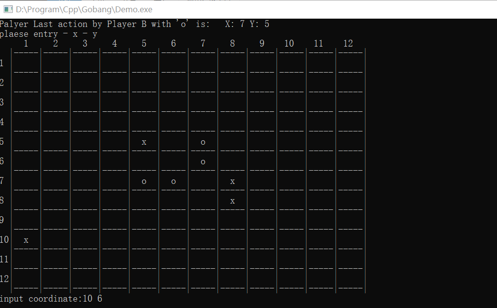

# Gobang
This repo is my 2019 Homework of UCAS C++ programming class

## 版本
- v0.1 基于评分的机器人(相当愚蠢)

## 结构
- [cmdChess.h](./cmdChess.h) **五子棋棋盘和双方落子**
- [test.cpp](./test.cpp)  **命令行界面 游戏运行主函数**
- Demo.exe
- README.md
- Example.png

## 运行截图

